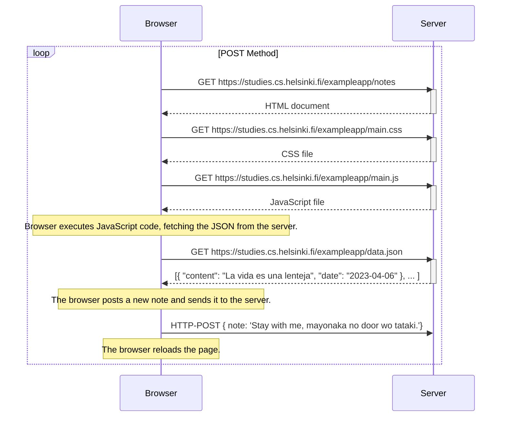
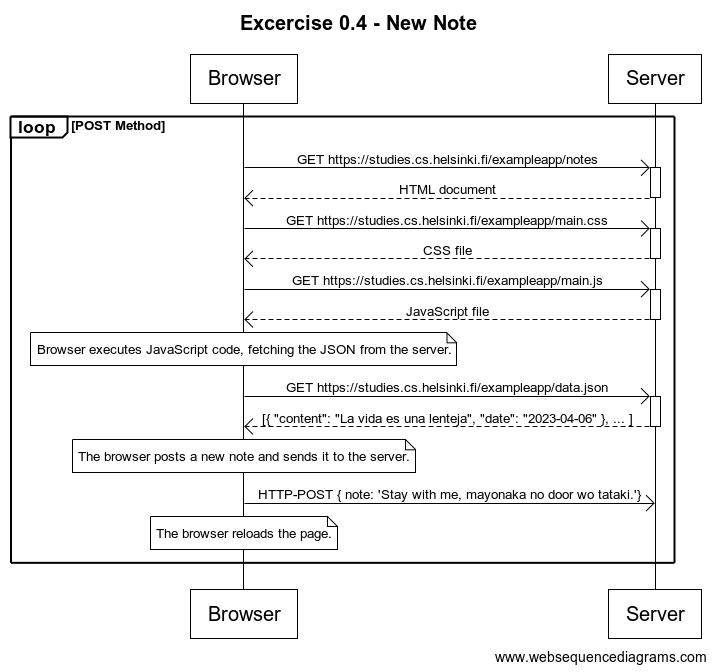

Title Excercise 0.4 - New Note

```mermaid
sequenceDiagram

        participant Browser
        participant Server

    loop POST Method

        Browser->>Server:   GET https://studies.cs.helsinki.fi/exampleapp/notes
        activate Server
        Server-->>Browser:  HTML document
        deactivate Server

        Browser->>Server:   GET https://studies.cs.helsinki.fi/exampleapp/main.css
        activate Server
        Server-->>Browser:  CSS file
        deactivate Server

        Browser->>Server:   GET https://studies.cs.helsinki.fi/exampleapp/main.js
        activate Server
        Server-->>Browser:  JavaScript file
        deactivate Server

    Note over Browser: Browser executes JavaScript code, fetching the JSON from the server.

        Browser->>Server: GET https://studies.cs.helsinki.fi/exampleapp/data.json
        activate Server
        Server-->>Browser: [{ "content": "La vida es una lenteja", "date": "2023-04-06" }, ... ]
        deactivate Server

    Note over Browser: The browser posts a new note and sends it to the server.

        Browser->>Server:   HTTP-POST { note: 'Stay with me, mayonaka no door wo tataki.'}

    Note over Browser: The browser reloads the page.
    end
```

