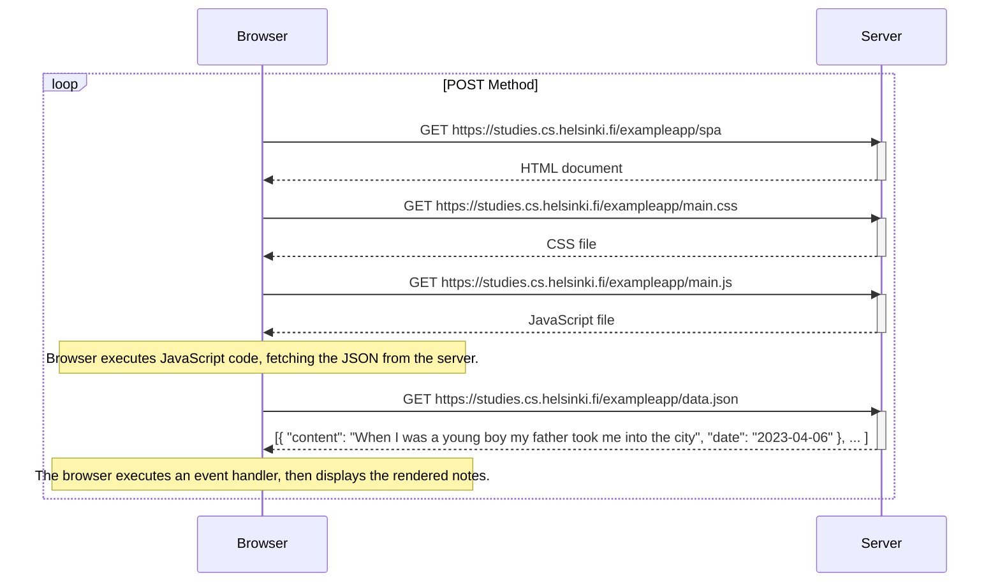
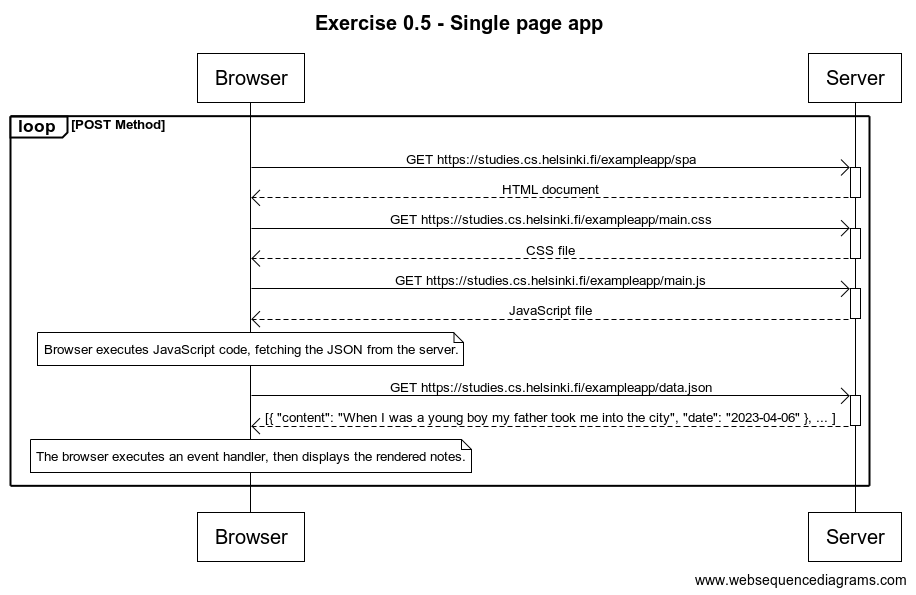

Title Exercise 0.5 - SPA

```mermaid
sequenceDiagram

        participant Browser
        participant Server

    loop POST Method

        Browser->>Server:   GET https://studies.cs.helsinki.fi/exampleapp/spa
        activate Server
        Server-->>Browser:  HTML document
        deactivate Server

        Browser->>Server:   GET https://studies.cs.helsinki.fi/exampleapp/main.css
        activate Server
        Server-->>Browser:  CSS file
        deactivate Server

        Browser->>Server:   GET https://studies.cs.helsinki.fi/exampleapp/main.js
        activate Server
        Server-->>Browser:  JavaScript file
        deactivate Server

    Note over Browser: Browser executes JavaScript code, fetching the JSON from the server.

        Browser->>Server:   GET https://studies.cs.helsinki.fi/exampleapp/data.json
        activate Server
        Server-->>Browser:  [{ "content": "When I was a young boy my father took me into the city", "date": "2023-04-06" }, ... ]
        deactivate Server

    Note over Browser: The browser executes an event handler, then displays the rendered notes.
    end
```

